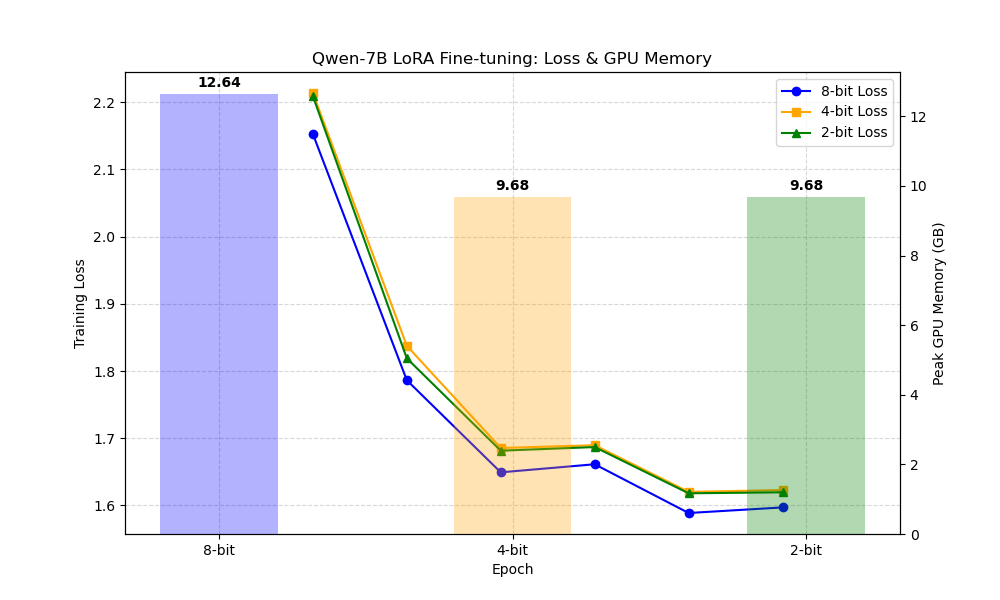

# Qwen-7B QLoRA Fine-tuning (Windows)

This project provides scripts and resources for fine-tuning the Qwen-7B language model using QLoRA (Quantized Low-Rank Adapter) techniques on Windows. It supports 2-bit, 4-bit, and 8-bit quantization, and includes dataset management, training scripts, and output checkpoints.

---

## Project Structure

```
├── quick_fix.ps1                  # PowerShell script for quick fixes
├── setup_qwen_env.bat             # Batch script to set up the Python environment
├── datasets/                      # Directory containing dataset files
│   ├── data-00000-of-00001.arrow
│   ├── dataset_info.json
│   └── state.json
├── outputs/                       # Training outputs and checkpoints
│   ├── Epoch_TrainLoss_Graph.png  # Training loss and GPU memory graph
│   ├── qwen7b_lora_2bit/          # 2-bit quantized adapter outputs
│   ├── qwen7b_lora_4bit/          # 4-bit quantized adapter outputs
│   └── qwen7b_lora_8bit/          # 8-bit quantized adapter outputs
├── scripts/
│   └── finetune_qwen7b_windows.py # Main fine-tuning script for Windows
```

---

## Getting Started

### 1. Environment Setup

Run the batch script to set up your Python environment and install dependencies:

```bat
setup_qwen_env.bat
```

### 2. Prepare Dataset

Place your dataset files in the `datasets/` directory. The default script uses the [databricks-dolly-15k](https://huggingface.co/datasets/databricks/databricks-dolly-15k) dataset, but you can modify the script to use your own data.

### 3. Fine-Tuning

Edit the `BIT_WIDTH` variable in `scripts/finetune_qwen7b_windows.py` to select 2, 4, or 8 for the desired quantization. Then run:

```powershell
python scripts/finetune_qwen7b_windows.py
```

Checkpoints and adapter models will be saved in the corresponding `outputs/qwen7b_lora_{2bit,4bit,8bit}/` directory.

### 4. Outputs

- **Epoch_TrainLoss_Graph.png**: Shows training loss and GPU memory usage for each quantization mode.



- **qwen7b_lora_{2bit,4bit,8bit}/**: Contains adapter model files, tokenizer, and checkpoints for each quantization.

---

## File Descriptions

- **quick_fix.ps1**: PowerShell script for troubleshooting or quick fixes.
- **setup_qwen_env.bat**: Sets up the Python environment and installs dependencies.
- **datasets/**: Contains the training dataset and metadata.
- **outputs/**: Stores training results, checkpoints, and graphs.
- **scripts/finetune_qwen7b_windows.py**: Main script for fine-tuning Qwen-7B using QLoRA on Windows.

---

## Requirements

- Windows OS
- Python 3.8+
- CUDA-enabled GPU
- Required Python packages (installed via `setup_qwen_env.bat`)

---

## References

- [Qwen Language Model](https://github.com/QwenLM/Qwen)
- [QLoRA: Efficient Finetuning of Quantized LLMs](https://arxiv.org/abs/2305.14314)
- [Databricks Dolly 15k Dataset](https://huggingface.co/datasets/databricks/databricks-dolly-15k)

---

